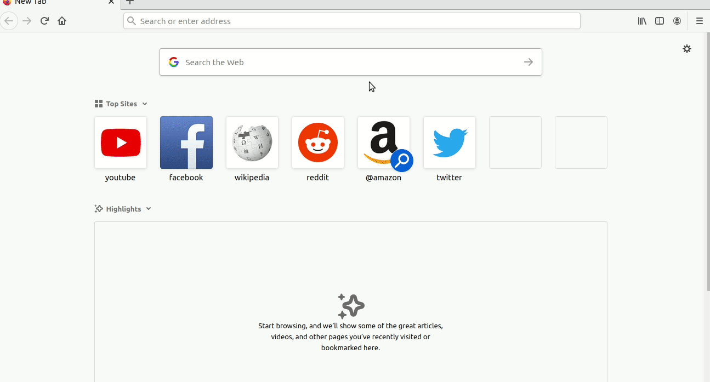

# ScholarHub 

ScholarHub is a Mozilla Firefox browser extension which simplifies the usage of [Google Scholar](https://en.wikipedia.org/wiki/Google_Scholar) and [Sci-Hub](https://en.wikipedia.org/wiki/Sci-Hub). I made this extension because I found copying links from journals and pasting them in scihub a "tedious" work :grin: .

## Features:
- After selecting text, on Rightclick an option will be available 'Search on Google Scholar'.
- After going into the home page of a research paper from google scholar, press on the scholarhub browser button. This will search the current research url in scihub.
- Alt+G will open a new Google Scholar tab.
- Ctrl+Alt+S will open a new Sci-Hub tab.

**Raise an Issue regarding any research-oriented feature, which you think will make this extension better.**

## Download:
This is a published add-on. Download and use from [here](https://addons.mozilla.org/addon/scholarhub/).
## How to test:

