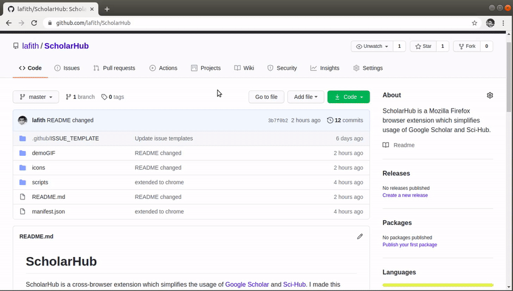
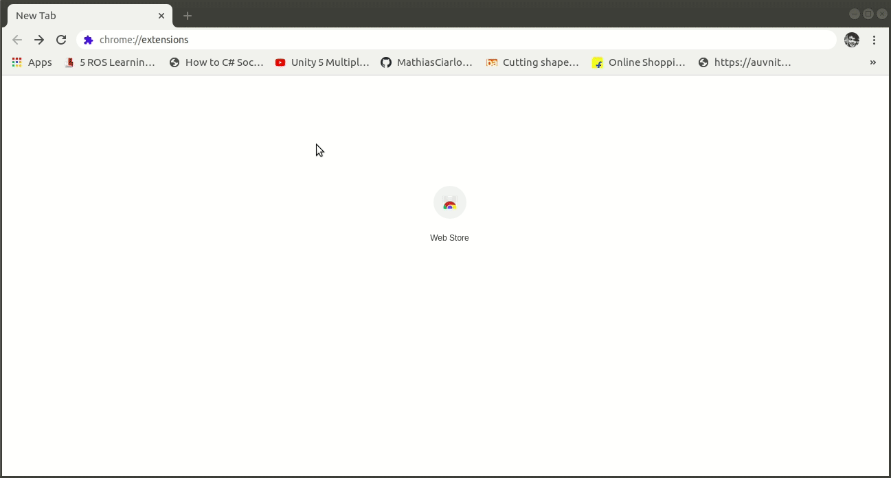

# ScholarHub 

ScholarHub is a cross-browser extension which simplifies the usage of [Google Scholar](https://en.wikipedia.org/wiki/Google_Scholar) and [Sci-Hub](https://en.wikipedia.org/wiki/Sci-Hub). I made this extension because I found copying links from journals and pasting them in scihub a "tedious" work :grin: .

**Add ScholarHub to Firefox from [here](https://addons.mozilla.org/en-US/firefox/addon/scholarhub/)**

*You have to download the source code for using in Google Chrome:*

## Features:
- On opening a browser, extension will search for the latest [working link](https://sci-hub.now.sh/) of Sci-Hub.
- Some search results of Google Scholar will not be having direct PDF link. This extension will include a clickable raven logo to them, which will search that url in Sci-Hub.
- Press on the scholarhub browser button to search the current tab's url in Sci-Hub.
- If doi link is available right click on it for 'search on Sci-Hub' option.
- After selecting text, on Rightclick an option will be available 'Search on Google Scholar'.
- Alt+G will open a new Google Scholar tab.
- Ctrl+Space will open a new Sci-Hub tab.

## Test:
If you want to download and use:

